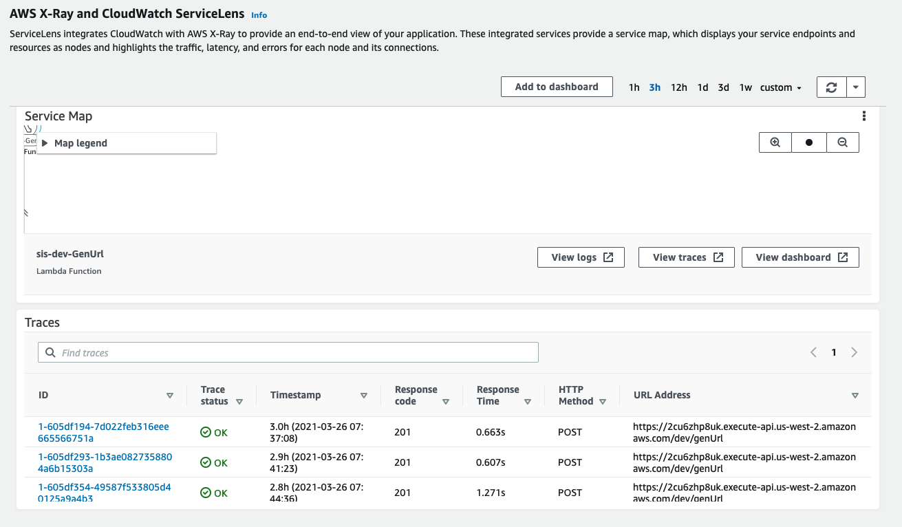

# Udacity Capstone Project
### Option: Serverless 

##### Project Outline
This is a simple Image Sharing App built utilizing Amplify for the frontend deployment and the serverless framework for the backend deployment. 
I built a VueJS custom frontend to handle signup and image uploading. 
I used Amplify for both Auth flow and Hosting. 
You will not need to clone the repo and run npm install in order to test this project. 
You will need a working email address to receive an auth code to verify your account per Cognito spec.
You can simply visit : [http://udapstone-20210326095331-hostingbucket-dev.s3-website-us-west-2.amazonaws.com/](http://udapstone-20210326095331-hostingbucket-dev.s3-website-us-west-2.amazonaws.com/) 

All lambda functions use individual handlers and generate CloudWatch logs:

X-Ray tracing is enabled:

